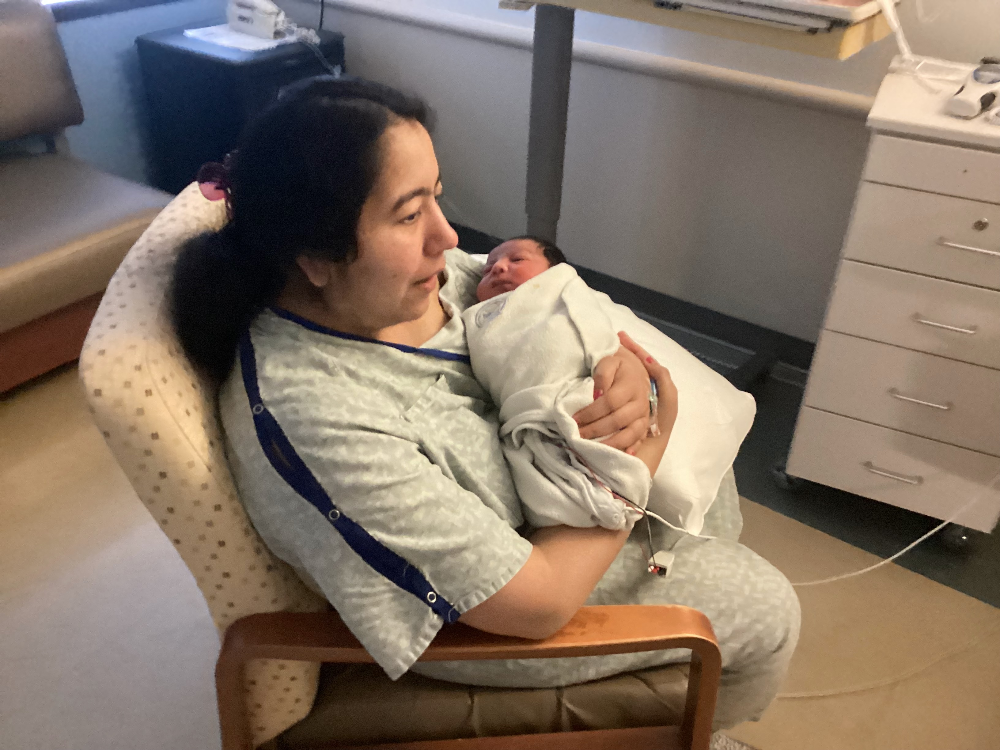
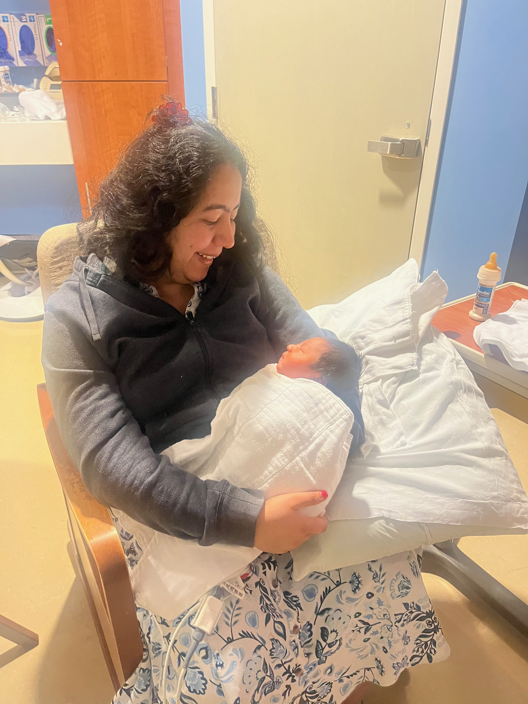
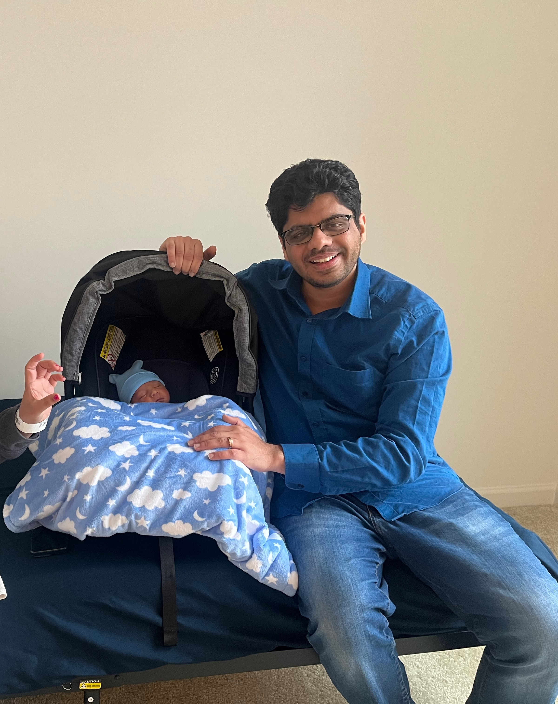

# Week of Inception

The day of birth is often regarded as the most difficult day in anyone's life. As a husband, watching your wife in pain, you feel almost helpless. You can support her, help her breathe, but beyond that, there’s not much you can do. 

Then, after what feels like an infinite number of moments, a new human being is born. We didn’t know the gender beforehand, so the first time I saw him, it was nothing short of magical. That moment turned one of the most challenging days into the happiest day of my life.

However, due to some complications, the doctors decided to keep our baby in the NICU. We were barely allowed to touch him, and watching him be taken away was a painful moment. We anxiously waited, wondering what might happen next. After what seemed like forever, the doctors allowed us to meet little Ojas after four hours.

They told us to avoid stimulating him and to keep him calm. They were closely monitoring his heart rate and oxygen levels, and though it was technically an ICU, the hospital staff had created such a positive, welcoming vibe—it felt more like a nursery than a medical facility.

The doctors and nurses took great care, constantly observing him. They even taught us the basics—how to hold him, change his diapers, and feed him.

Just as we thought we were about to bring him home, another complication arose. He had to stay under observation for 48 more hours. This was a tough realization—I truly understood what stress meant. We constantly monitored his condition. During this time, I called my dad frequently for reassurance. He’d calm me down, and it hit me—I am now a dad too. My father, at 70 years old, still had to soothe me, and I knew that if I could soothe Ojas even just 10% of what my dad did for me, that would be enough. It made me realize how great my dad is, and I want to mirror his strength for Ojas.

After 48 hours, the doctors confirmed that Ojas was doing great, and we finally got the good news that the baby is fully healed and ready to go home.

It was a thunderstorm and quite cold when we were discharged. We had to buy new blankets from the store, and I noticed that for boys, there was only one type of blanket, while for girls, there were multiple designs.

Nurses trained us on how to use car seats and gave us detailed instructions on what to do once we got home. I had taken multiple courses from BabyCenter and attended some in-person classes about newborns, but the nurses provided crystal-clear instructions. It felt like a crash course for me, better than all the other 30-40 hours of classes combined. It was mainly because we were in survival mode and had to grasp as much information as possible in such a short amount of time.

Then, we rode back home. This was my first ride with Ojas, and it really hit me—the weight of responsibility that comes with being a parent.

